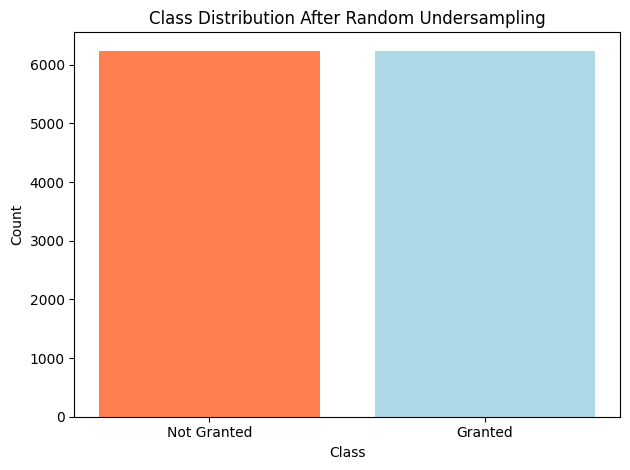
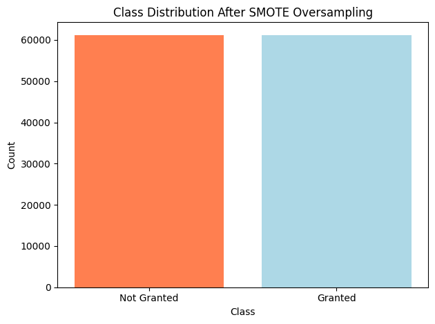
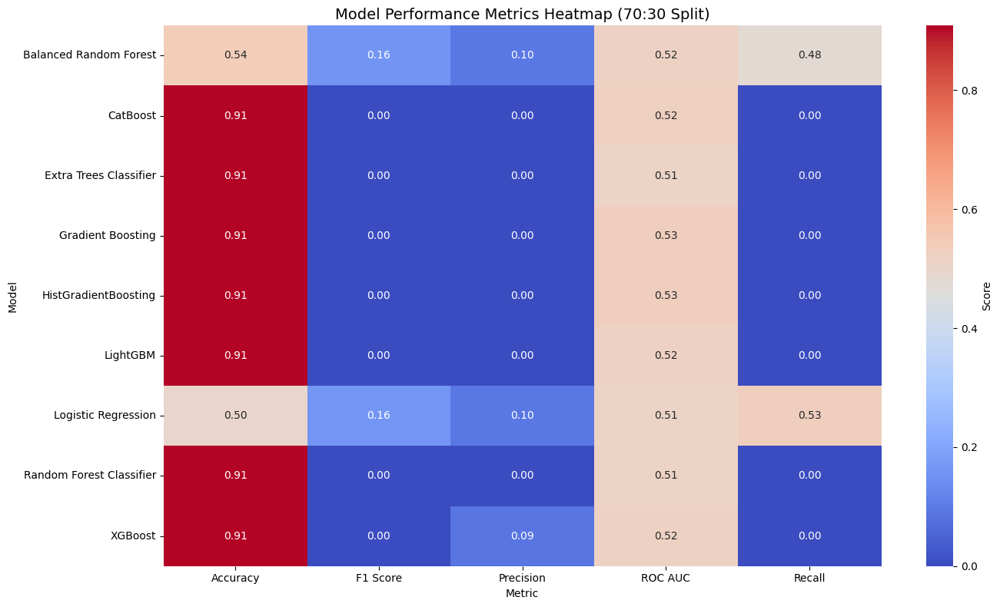

# Loan Eligibility Prediction Using Machine Learning

This project explores the development of an optimized machine learning model for predicting loan eligibility. Using a dataset containing 67,463 rows and 35 attributes, we evaluated multiple machine learning techniques to improve accuracy, interpretability, and fairness in credit risk assessments. The research provides actionable insights for deploying trustworthy AI in the financial services domain.

## Problem Statement

Manual lending decisions are inconsistent, subjective, and prone to delays. Traditional methods struggle with adapting to diverse data and capturing complex interactions. Machine learning provides scalable, data-driven solutions to accurately predict loan eligibility while maintaining transparency and accountability.

## Objectives

- Develop interpretable machine learning models for loan eligibility prediction.
- Handle class imbalance effectively using techniques like undersampling and SMOTE.
- Evaluate models on metrics such as accuracy, precision, recall, F1 Score, and AUC-ROC.
- Provide recommendations for deploying responsible AI in financial services.

## Research Questions

1. What machine learning models and hyperparameters optimize predictive performance for credit risk modeling?  
2. What are the biases and limitations in the models' predictions, and how can they be mitigated through responsible AI?  
3. How do the model's predictions align with domain expert assessments for real-world deployment?

## Dataset

### Source
- Platform - Kaggle  
- URL - [Loan Default Prediction Dataset](https://www.kaggle.com/datasets/hemanthsai7/loandefault)  
- Structure - 67,463 rows and 35 attributes  

### Key Features

| **Feature Name**           | **Description**                          | **Type**         |
|-----------------------------|------------------------------------------|------------------|
| `Loan_ID`                  | Unique identifier for the loan           | Categorical      |
| `Gender`                   | Gender of the applicant                  | Categorical      |
| `Married`                  | Applicant's marital status               | Categorical      |
| `Dependents`               | Number of dependents                     | Ordinal          |
| `Education`                | Education level of the applicant         | Categorical      |
| `Self_Employed`            | Indicates if the applicant is self-employed | Categorical    |
| `ApplicantIncome`          | Monthly income of the applicant          | Continuous       |
| `CoapplicantIncome`        | Monthly income of the co-applicant       | Continuous       |
| `LoanAmount`               | Amount of the loan requested             | Continuous       |
| `Loan_Amount_Term`         | Term (duration) of the loan (in months)  | Continuous       |
| `Credit_History`           | Record of previous credit history        | Ordinal          |
| `Property_Area`            | Type of area where property is located   | Categorical      |
| `Loan_Status`              | Status of loan approval (Y/N)            | Categorical      |

## Tools and Libraries

- Python  
- **Libraries**:
  - Data Processing - `pandas`, `numpy`  
  - Visualization - `matplotlib`, `seaborn`  
  - Machine Learning - `scikit-learn`, `xgboost`, `lightgbm`, `catboost`  
  - Class Imbalance Management - `imblearn`  
  - Model Explainability - `shap`, `lime`  

## Project Workflow

### 1. Data Understanding and Preparation
We performed exploratory data analysis to identify class imbalance and variable distributions. The data was cleaned by removing irrelevant features and applying one-hot encoding for categorical variables. Class imbalance was addressed using SMOTE and undersampling techniques.

The bar plot shows the distribution of the loan status before applying any sampling techniques.  


The bar plot shows the balanced distribution of the loan status after applying random undersampling, which reduces the majority class to match the minority class.  


The bar plot demonstrates the balanced distribution of the loan status after applying SMOTE (Synthetic Minority Oversampling Technique), which increases the minority class by generating synthetic samples.  


### 2. Modeling
- Random Forest
- Balanced Random Forest
- AdaBoost
- Gradient Boosting
- Logistic Regression
- Decision Tree

### 3. Evaluation
- Accuracy - Overall correctness of predictions
- Precision - Fraction of correctly predicted positives
- Recall - Fraction of actual positives identified
- F1 Score - Harmonic mean of precision and recall
- AUC-ROC - Model’s ability to differentiate between classes  

The chart below illustrates the accuracy comparison of evaluated models.  


### 4. Explainability
- Global Interpretability - Feature importance and Partial Dependence Plots
- Local Interpretability - SHAP and LIME for instance-level explanations

## Key Findings

- The Random Forest Classifier achieved the highest accuracy of **0.908444**, but precision, recall, and F1 scores were **0.000000**, highlighting its poor performance in predicting the minority class.
- The balanced Random Forest model showed a recall of **0.476525**, significantly outperforming other models in identifying the minority class.
- The balanced Random Forest model achieved an accuracy of **0.539305** and an AUC-ROC of **0.517680**.

The heatmap below highlights model performance metrics across different machine learning algorithms.  


### Results Summary

| Model                    | Train Ratio | Test Ratio | Accuracy  | Precision  | Recall     | F1 Score   | ROC AUC   |
|--------------------------|-------------|------------|-----------|------------|------------|------------|-----------|
| Balanced Random Forest   | 0.7         | 0.3        | 0.539305  | 0.095594   | 0.476525   | 0.159243   | 0.517680  |
| Random Forest Classifier | 0.7         | 0.3        | 0.908444  | 0.000000   | 0.000000   | 0.000000   | 0.511748  |
| HistGradientBoosting     | 0.7         | 0.3        | 0.908444  | 0.000000   | 0.000000   | 0.000000   | 0.532165  |
| Gradient Boosting        | 0.7         | 0.3        | 0.908296  | 0.000000   | 0.000000   | 0.000000   | 0.529089  |
| Logistic Regression      | 0.7         | 0.3        | 0.497900  | 0.095669   | 0.530491   | 0.162104   | 0.509727  |
| Extra Trees Classifier   | 0.7         | 0.3        | 0.908444  | 0.000000   | 0.000000   | 0.000000   | 0.509418  |
| XGBoost                  | 0.7         | 0.3        | 0.907061  | 0.088235   | 0.001619   | 0.003180   | 0.515296  |
| LightGBM                 | 0.7         | 0.3        | 0.908444  | 0.000000   | 0.000000   | 0.000000   | 0.520241  |
| CatBoost                 | 0.7         | 0.3        | 0.908395  | 0.000000   | 0.000000   | 0.000000   | 0.524337  |

## Conclusion
This research demonstrates the potential of machine learning for loan eligibility prediction. By integrating sampling techniques, ensemble methods, and explainability tools, we developed a robust and interpretable model. The findings contribute to the growing body of research on responsible AI for financial decision-making.


## How to Run the Project

1. **Clone the Repository**
   Open your terminal or command prompt and run the following commands:
   ```bash
   git clone https://github.com/ShubhamAggarwal/loan_prediction
   cd loan-eligibility-prediction
2. **Install Required Libraries**
    Ensure you have Python 3.7 or later installed. Install the required libraries using the following command:

    ```bash
    pip install pandas numpy matplotlib seaborn scikit-learn imbalanced-learn shap
    ```
3. **Prepare the Dataset**  
   Verify the dataset (e.g., `train.csv`) is included in the repository. Download it from the source if missing.

4. **Run the Project Notebook**  
   Open and execute `loan_prediction.ipynb` in Jupyter Notebook or any compatible environment.

5. **Review Outputs**  
   Examine the outputs in the notebook for metrics, graphs, and explainability visualizations.
