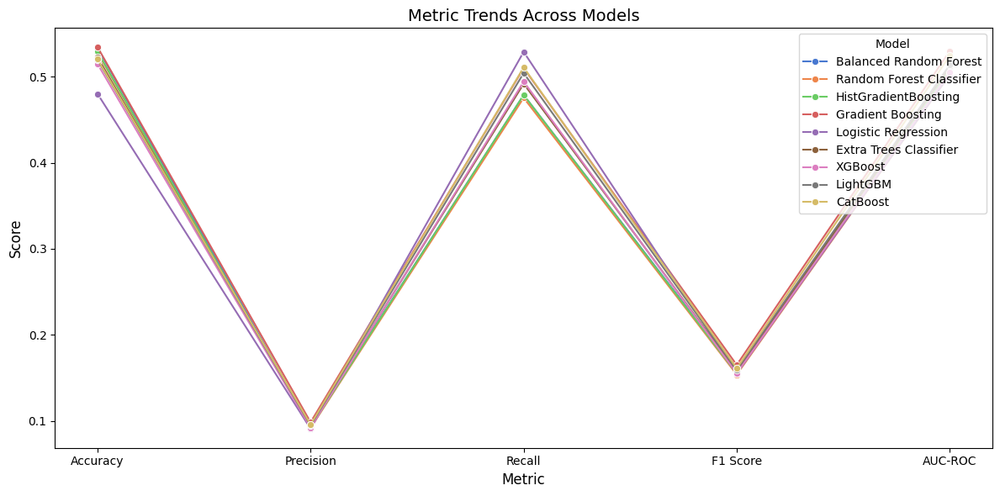
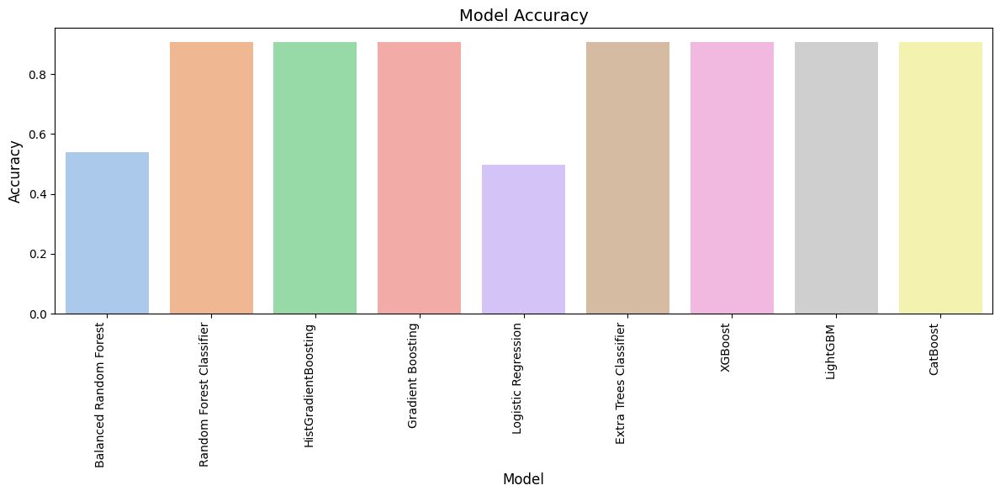

# Loan Eligibility Prediction Using Machine Learning

This project explores the development of an optimized machine learning model for predicting loan eligibility. Using a dataset containing 67,463 rows and 35 attributes, we evaluated multiple machine learning techniques to improve accuracy, interpretability, and fairness in credit risk assessments. The research provides actionable insights for deploying trustworthy AI in the financial services domain.


## **Problem Statement**

Manual lending decisions are inconsistent, subjective, and prone to delays, leading to suboptimal credit risk assessment. Traditional methods, such as regression models, struggle with adapting to diverse data and capturing complex interactions. Machine learning provides scalable, data-driven solutions to accurately predict loan eligibility while maintaining transparency and accountability.


## **Objectives**

- Develop interpretable machine learning models for loan eligibility prediction.
- Handle class imbalance effectively using techniques like undersampling and SMOTE.
- Evaluate models on metrics such as accuracy, precision, recall, F1 Score, and AUC-ROC.
- Provide recommendations for deploying responsible AI in financial services.


## **Research Questions**

1. What machine learning models and hyperparameters optimize predictive performance for credit risk modeling?  
2. What are the biases and limitations in the models’ predictions, and how can they be mitigated through responsible AI?  
3. How do the model’s predictions align with domain expert assessments for real-world deployment?


## **Dataset**

### **Source**
- **Platform**: Kaggle  
- **URL**: [Loan Default Prediction Dataset](https://www.kaggle.com/datasets/hemanthsai7/loandefault)  
- **Structure**: 67,463 rows and 35 attributes  

### **Key Features**

| **Feature Name**           | **Description**                          | **Type**         |
|-----------------------------|------------------------------------------|------------------|
| `Loan_ID`                  | Unique identifier for the loan           | Categorical      |
| `Gender`                   | Gender of the applicant                  | Categorical      |
| `Married`                  | Applicant's marital status               | Categorical      |
| `Dependents`               | Number of dependents                     | Ordinal          |
| `Education`                | Education level of the applicant         | Categorical      |
| `Self_Employed`            | Indicates if the applicant is self-employed | Categorical    |
| `ApplicantIncome`          | Monthly income of the applicant          | Continuous       |
| `CoapplicantIncome`        | Monthly income of the co-applicant       | Continuous       |
| `LoanAmount`               | Amount of the loan requested             | Continuous       |
| `Loan_Amount_Term`         | Term (duration) of the loan (in months)  | Continuous       |
| `Credit_History`           | Record of previous credit history        | Ordinal          |
| `Property_Area`            | Type of area where property is located   | Categorical      |
| `Loan_Status`              | Status of loan approval (Y/N)            | Categorical      |

 


## **Tools and Libraries**

-  Python  
- **Libraries**:
  - Data Processing: `pandas`, `numpy`  
  - Visualization: `matplotlib`, `seaborn`  
  - Machine Learning: `scikit-learn`, `xgboost`, `lightgbm`, `catboost`  
  - Class Imbalance Management: `imblearn`  
  - Model Explainability: `shap`, `lime`  


## **Project Workflow**

### **1. Data Understanding and Preparation**
- Performed exploratory data analysis to identify class imbalance and variable distributions.  
- Cleaned data by removing irrelevant and redundant features.  
- Applied one-hot encoding for categorical variables.  
- Handled class imbalance using SMOTE and undersampling techniques.

### **2. Modeling**
- Evaluated six machine learning models:
  - Random Forest
  - Balanced Random Forest
  - AdaBoost
  - Gradient Boosting
  - Logistic Regression
  - Decision Tree

### **3. Evaluation**
- Metrics:
  - **Accuracy**: Overall correctness of predictions.  
  - **Precision**: Fraction of correctly predicted positives.  
  - **Recall**: Fraction of actual positives identified.  
  - **F1 Score**: Harmonic mean of precision and recall.  
  - **AUC-ROC**: Model’s ability to differentiate between classes.  
- Confusion matrices and ROC curves visualized model performance.  

### **4. Explainability**
- Global Interpretability: Feature importance, Partial Dependence Plots.  
- Local Interpretability: SHAP and LIME for instance-level explanations.


## **Key Findings**

- The **Random Forest Classifier** achieved the highest accuracy of **0.908444**, but precision, recall, and F1 scores were **0.000000**, highlighting its poor performance in predicting the minority class.
### Model Performance Metrics Heatmap


- **Balanced Random Forest** model showed a recall of **0.476525**, significantly outperforming other models in identifying the minority class, with an accuracy of **0.539305** and AUC-ROC of **0.517680**.

- The highest AUC-ROC score of **0.532165** was achieved by **HistGradientBoosting**, indicating moderate separation capability between the classes.

- The imbalanced dataset resulted in several models (e.g., **LightGBM, Extra Trees, CatBoost**) achieving zero precision, recall, and F1 scores despite high accuracy values (~**0.908**).

   

## **Results Summary**

| Model                    | Train Ratio | Test Ratio | Accuracy  | Precision  | Recall     | F1 Score   | ROC AUC   |
|--------------------------|-------------|------------|-----------|------------|------------|------------|-----------|
| Balanced Random Forest   | 0.7         | 0.3        | 0.539305  | 0.095594   | 0.476525   | 0.159243   | 0.517680  |
| Random Forest Classifier | 0.7         | 0.3        | 0.908444  | 0.000000   | 0.000000   | 0.000000   | 0.511748  |
| HistGradientBoosting     | 0.7         | 0.3        | 0.908444  | 0.000000   | 0.000000   | 0.000000   | 0.532165  |
| Gradient Boosting        | 0.7         | 0.3        | 0.908296  | 0.000000   | 0.000000   | 0.000000   | 0.529089  |
| Logistic Regression      | 0.7         | 0.3        | 0.497900  | 0.095669   | 0.530491   | 0.162104   | 0.509727  |
| Extra Trees Classifier   | 0.7         | 0.3        | 0.908444  | 0.000000   | 0.000000   | 0.000000   | 0.509418  |
| XGBoost                  | 0.7         | 0.3        | 0.907061  | 0.088235   | 0.001619   | 0.003180   | 0.515296  |
| LightGBM                 | 0.7         | 0.3        | 0.908444  | 0.000000   | 0.000000   | 0.000000   | 0.520241  |
| CatBoost                 | 0.7         | 0.3        | 0.908395  | 0.000000   | 0.000000   | 0.000000   | 0.524337  |


### Model Performance Comparison Across Metrics 


### Metric Trends Across Models


### Model Accuracy



## **Conclusion**

This research demonstrates the potential of machine learning for loan eligibility prediction. By integrating sampling techniques, ensemble methods, and explainability tools, we developed a robust and interpretable model. The findings contribute to the growing body of research on responsible AI for financial decision-making.


## **How to Run the Project**

1. **Clone the Repository**:
   - Open your terminal or command prompt and run the following commands:
     ```bash
     git clone https://github.com/Shubham Aggarwal/loan-eligibility-prediction
     cd loan-eligibility-prediction
     ```

2. **Install Required Libraries**:
   - Ensure you have Python 3.7 or later installed on your system.
   - Manually install the required libraries listed in the project (if not already installed):
     ```bash
     pip install pandas numpy matplotlib seaborn scikit-learn imbalanced-learn shap
     ```

3. **Prepare the Dataset**:
   - Verify the dataset (e.g., `train.csv`) is included in the repository.
   - If missing, download it from the source and place it in the `data/` directory.

4. **Run the Project Notebook**:
   - Open the Jupyter Notebook (e.g., `Loan_Prediction.ipynb`) in Jupyter Notebook, VS Code, or any compatible environment.
   - Execute the cells step-by-step:
     - Handle missing values, feature encoding, and other cleaning steps.
     - Train models like Random Forest, Gradient Boosting, etc.
     - Evaluate the models using metrics like accuracy, precision, recall, and F1-score.

5. **Review Outputs**:
   - Check the outputs in the notebook:
     - Metrics and graphs for model performance.
     - SHAP or other explainability visualizations.


  ## Visualizations

### 1. Class Distribution Before Sampling
- The bar plot shows the distribution of the loan status before applying any sampling techniques. The dataset is highly imbalanced, with a significantly larger number of "Not Granted" loans compared to "Granted" loans.


### 2. Class Distribution After Random Undersampling
- The bar plot shows the balanced distribution of the loan status after applying random undersampling, which reduces the majority class to match the minority class.


### 3. Class Distribution After SMOTE Oversampling
- The bar plot demonstrates the balanced distribution of the loan status after applying SMOTE (Synthetic Minority Oversampling Technique), which increases the minority class by generating synthetic samples.


### 4. Count of Loans by Grade
- The bar plot shows the distribution of loan grades. Grades B and C have the highest number of loans, while Grade G has the least.


### 5. Loan Amount by Grade
- The box plot visualizes the distribution of loan amounts across different grades, showing how the loan amounts vary by grade.


### 6. Skewness of Numerical Features
- The bar plot represents the skewness of numerical features in the dataset. Highly skewed features may require transformations to normalize their distributions.


### 7. Unique Values in Categorical Columns
- The bar plot shows the number of unique values in categorical columns, helping identify features with high cardinality or limited diversity.


### 8. Expanded Model Metrics Comparison
- The bar plot compares the performance metrics of various models (accuracy, precision, recall, etc.) based on the evaluation results.


### 9. Model Performance Comparison Across Metrics (70:30 Split)
- The bar plot compares model performance metrics for a 70:30 train-test split, highlighting metrics such as accuracy, precision, and ROC AUC.


### **Important Notes**
- Ensure the dataset structure matches the notebook's expectations.
- For questions, refer to the comments and markdown sections within the notebook.

